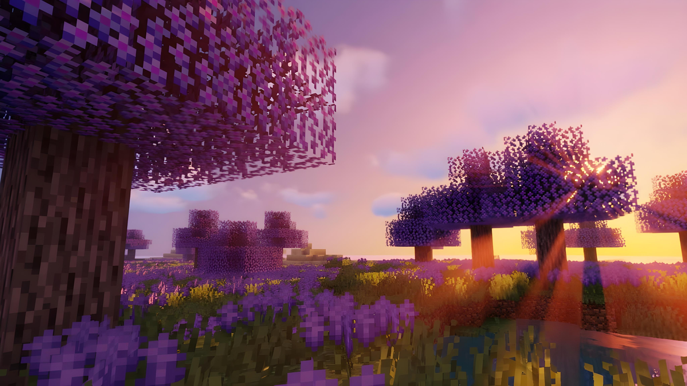

# Andromeda(http://goafuel.github.io/Andromeda/)

**Andromeda** is an educational website designed to guide players through the many dimensions of Minecraft gameplay. Whether you're new to the game or seeking to master advanced mechanics, Andromeda provides clear, engaging, and accessible tutorials for all core aspects of Minecraft.



---

## 🌟 About the Website

Andromeda breaks down the essential elements of Minecraft into focused, easy-to-navigate guides. Each section of the website is dedicated to a core theme of the game, with step-by-step instructions, pro tips, and terminology explanations to help you thrive and create in the world of Minecraft.

---

## 📚 Sections Overview

- **Survival Mastery**  
  Tips and strategies for thriving in Survival Mode: resource gathering, crafting, building shelters, and defending against mobs.

- **Creative Building**  
  Unlock your imagination with tutorials on Creative Mode: flying, building techniques, architectural design, and harnessing advanced tools.

- **Mining Essentials**  
  Master the art of mining with efficient methods, ore locations, safety advice, and ways to maximize your resource yield.

- **Redstone Engineering**  
  A beginner-friendly introduction to Redstone: learn to build simple machines, automate tasks, and craft complex contraptions.

- **Exploration Odyssey**  
  Discover the wonders of Minecraft’s vast worlds: navigation, biomes, ocean and cave exploration, and tips for surviving in the Nether and End.

- **Dictionary**  
  Linked throughout the guides, the dictionary page explains common Minecraft terms to help every player understand game mechanics.

---

## 🚀 Getting Started

1. **Clone or Download the Repository**
   ```sh
   git clone https://github.com/goafuel/Andromeda.git
   ```
2. **Open the Website**
   - Open `index.html` (or the main page) in your web browser to explore the guides.

3. **Navigate**
   - Use the in-site navigation or the Home button on any page to move between sections.

---

## 🗂️ Project Structure

- `index.html` — The main homepage of Andromeda
- `1Survival.html`, `2Creative.html`, `3Mining.html`, `4Redstone.html`, `5Exploration.html` — Themed guide pages
- `dictionary.html` — Minecraft terminology reference
- `style.css` – CSS styles for the whole webpage.
- `Subpages.css` — CSS styles for subpages.
- `Home.jpg` — Banner or cover image
- Other background images not specified.

---

## ✨ Features

- Clean, modern, and responsive design
- Beginner and advanced tips for all play styles
- In-line links to definitions for unfamiliar terms
- Ready to be extended with new guides or sections

---

## 🛠️ Customization

Feel free to modify the HTML and CSS files to tailor the guides to your Minecraft experiences or add new sections.  
If you make improvements, consider sharing them through pull requests.

---

## 📖 License

Specify your project’s license here (MIT, Apache-2.0, etc.).

---

**Created by [goafuel](https://github.com/goafuel) — Happy Crafting!**
